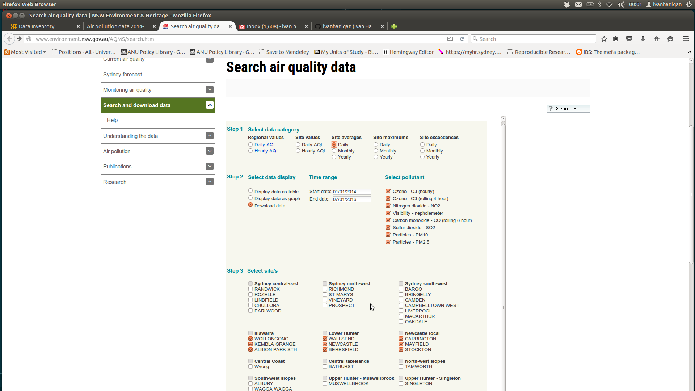

# Aim
- clean the data
- standardise to same format as biomass smoke event database
- this standardisation is required so that these can be imported to the database and so that the imputed network average and extreme events can be computed downstream in the biomass_smoke_events_db project

# Data methods

## Step 1: Visit the website and download the data

Visit the website [http://www.environment.nsw.gov.au/AQMS/search.htm]() then:

1. select data category = 'daily averages/max/min), 
2. select 'download', 
3. sites (do this by region, as required), then 'load data'

As the data downloads can be time consuming and convoluted do these by region and keep track in a table:

```{r, results = 'asis', echo = F}
#dir("data_provided")
tab <- read.csv(textConnection("region, filename
sydney, tmp_table_23378_1451991105.xls
newcastle and wollongong, tmp_table_29073_1452172650.xls
"), stringsAsFactor = F)
print(xtable::xtable(tab), type = "html", include.rownames = F)
```

Below is a screenshot of this procedure:



# Conclusions
